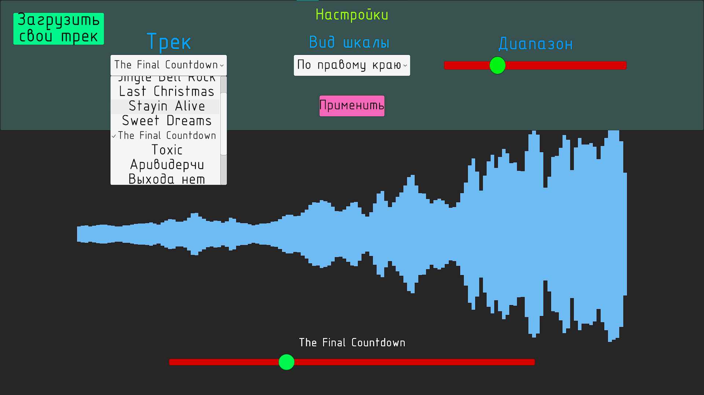

# SoundEqualizer

## Содержание
1. [Версия 0.1](#версия-0.1)

## Версия 0.1

### Реализованные фичи
- Визуализатор частотных характеристик
 - С выравниванием по левому краю
 - С выравниванием по правому краю
 - С отзеркаливанием от центра
- Параметризация входных данных
 - Выбор трека для воспроизведения
 - Выбор типа визуализации
 - Выбор диапазона визуализации
- Перемотка трека с помощью слайдера
- Загрузка своего трека с устройства

### Скриншоты версии

